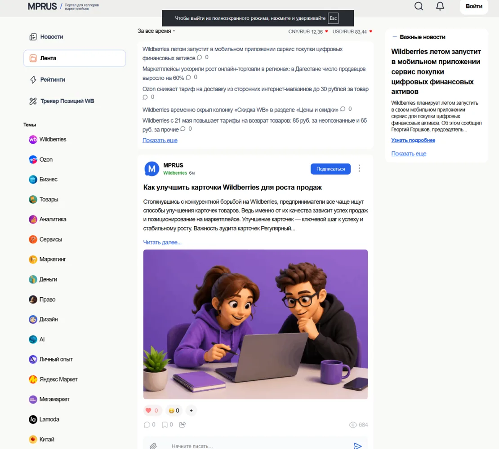
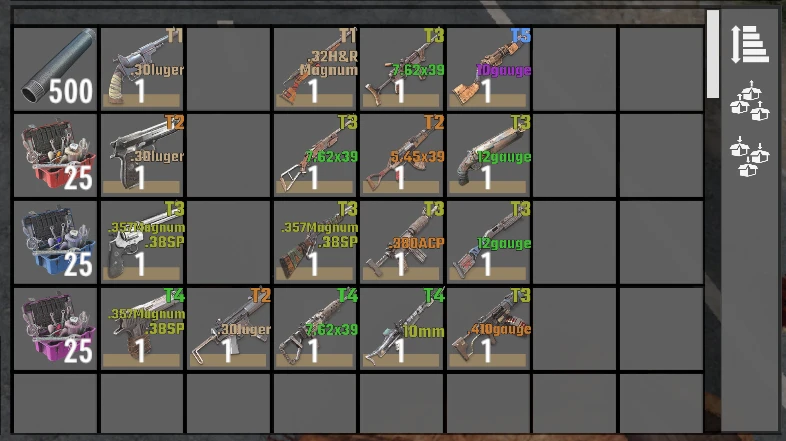

# axnikita / Zonov Nikita

**Full-stack WEB developer · PHP / JavaScript / WordPress · GameDev / tooling**

This repository contains the published version of my portfolio.

The site is intentionally simple at the deployment level: it is a static GitHub Pages project with three independently accessible pages and no required backend or framework runtime.

<p align="center">
  
  
</p>

## Portfolio

The portfolio is split into three sections:

- **About** — background, stack and project timeline;
- **WEB** — commercial and personal WEB projects from 2019–2026;
- **GameDev** — games, mods, balance systems and development tooling.

The content is based on real projects and source archives rather than demo applications created specifically for the portfolio.

## Main stack

My primary commercial stack is:

`PHP` · `JavaScript` · `WordPress` · `MySQL`

Depending on the project, this also includes REST APIs, SPA-like navigation, WebSocket, caching, Redis/KeyDB, Gearman, cron, Apache/Nginx, payment and delivery integrations.

GameDev runs in parallel: C++, C#, Unity, JavaScript modding, XML/JSON configuration and PHP tools for generating and balancing content.

## Selected work

### MPRUS — 2025–2026

A WordPress-based information/social platform for marketplace sellers.

The project includes a custom API dispatcher, nonce checks, weighted rate limiting, reactions, bookmarks, subscriptions, notifications and a generalized `InfiniteLoader` architecture for Post/User/Term/Comment.

**Stack:** PHP · WordPress · JavaScript · MySQL · WP Object Cache

### MamaMind / Momspace — 2025

A custom WordPress theme developed from scratch for a large parenting and pregnancy portal.

The project uses server-rendered pages with SPA-like navigation, `axLoader` / `domLoader`, dynamic pagination, infinite article loading, custom search, CPTs, reactions, comments and SEO integrations.

**Stack:** PHP · WordPress · Vanilla JS · SCSS/CSS

### Production legacy / commerce — 2022–2024

Long-term work inside a large PHP 7.4 production system.

The scope included call-center tools, calculators, tables, payment pages, delivery/payment API integrations and changes inside an existing legacy codebase where new functionality had to coexist with established business flows.

**Stack:** PHP 7.4 · external APIs · payments · delivery integrations

### AxNikita.com and own libraries — 2021–2022

A custom full-stack personal site without a CMS/framework: personal accounts, reviews, achievements, WebSocket chat and client-side dynamic loading.

Part of that code later grew into reusable PHP and JavaScript libraries, including the early versions of `axnikitaJS`.

**Stack:** PHP · JavaScript · MySQL · WebSocket · HTML · SCSS/CSS

### KazAXLibers — 2024–2026

A large 7 Days to Die weapon/ammunition overhaul with a separate PHP development environment.

The build tools generate XML configuration, balance spreadsheets, reports and icon variants. Weapon/ammunition balance is evaluated through calculated Power/Profit values, recipe cost is recursively reduced to base resources, and game content is maintained in three languages.

**Stack:** PHP · XML/XPath · JSON · ImageMagick · PHPExcel

### Uranium — 2020–2022

A large Mindustry mod with new ammunition, turrets, progression, random quality, factories and multiplayer state synchronization.

Instead of copying large blocks of content, the mod uses common creator/factory functions for bullets, turrets and buildings.

**Stack:** JavaScript · Mindustry API · Java interop · HJSON/JSON

## Current repository implementation

The currently published branch is a static site.

```text
.
├── index.html
├── web/
│   └── index.html
├── gamedev/
│   └── index.html
└── assets/
    ├── about/
    ├── web/
    ├── gamedev/
    ├── css/
    │   ├── about.css
    │   ├── web.css
    │   └── gamedev.css
    └── js/
        ├── about.js
        ├── web.js
        ├── gamedev.js
        ├── site-runtime.js
        └── axnikitaJS.js
```

There is no mandatory build step in the published version: each route can be opened directly and GitHub Pages serves the files as-is.

The page-specific JavaScript implements the portfolio interactions, including:

- RU / EN switching;
- the horizontal experience timeline;
- project gallery lightboxes;
- desktop case navigation;
- the mobile vertical case-progress/minimap;
- responsive behavior and small runtime helpers.

## axnikitaJS in the published branch

The repository currently contains the **2.31** version of my `axnikitaJS` library — the version originally used by the prototypes from this generation of the site.

`axnikitaJS` started as reusable browser infrastructure extracted from my earlier projects: DOM helpers, requests/loaders, dynamic content loading and SPA-related behavior.

A separate modernization of the library to **3.x** is in progress. The public README deliberately distinguishes that work from what is already present in this branch.

## Why the repository is static

For the portfolio itself I prefer normal HTML routes first:

```text
/
├── web/
└── gamedev/
```

That gives the project a simple deployment model and keeps every page directly accessible without requiring a backend.

The application architecture can evolve independently of the hosting model.

## Current refactor

The next iteration is being prepared separately and is **not claimed as already implemented in the published branch**.

Its goals are:

- migration to `axnikitaJS 3.0.1`;
- native `[spa]` navigation through the library;
- a single source of markup for the header and footer;
- modern modular SCSS instead of duplicated compiled page styles;
- keeping normal static URLs and GitHub Pages deployment;
- preserving the approved desktop/mobile layouts.

The important part is that the refactor should reduce duplication without changing the portfolio into a framework demo.

## Repository principles

For this project I keep a few constraints explicit:

- real project screenshots instead of invented interfaces;
- no fabricated metrics;
- normal URLs must remain usable;
- mobile is treated as a separate composition, not only a reduced desktop layout;
- screenshots are not cropped when cropping removes meaningful UI;
- changes are checked at desktop, tablet and narrow mobile widths.

## Links

- GitHub: [ax-nikita](https://github.com/ax-nikita)
- Kwork: [axnikita](https://kwork.ru/user/axnikita)
- Uranium source: [ax-nikita/uranium-mod](https://github.com/ax-nikita/uranium-mod)

---

<details>
<summary><strong>English / Russian note</strong></summary>

Основная часть README оставлена на английском, потому что репозиторий публичный и используется как часть портфолио.

Сам сайт поддерживает RU/EN и содержит более подробное описание проектов, роли, реализации и технических решений.

</details>
